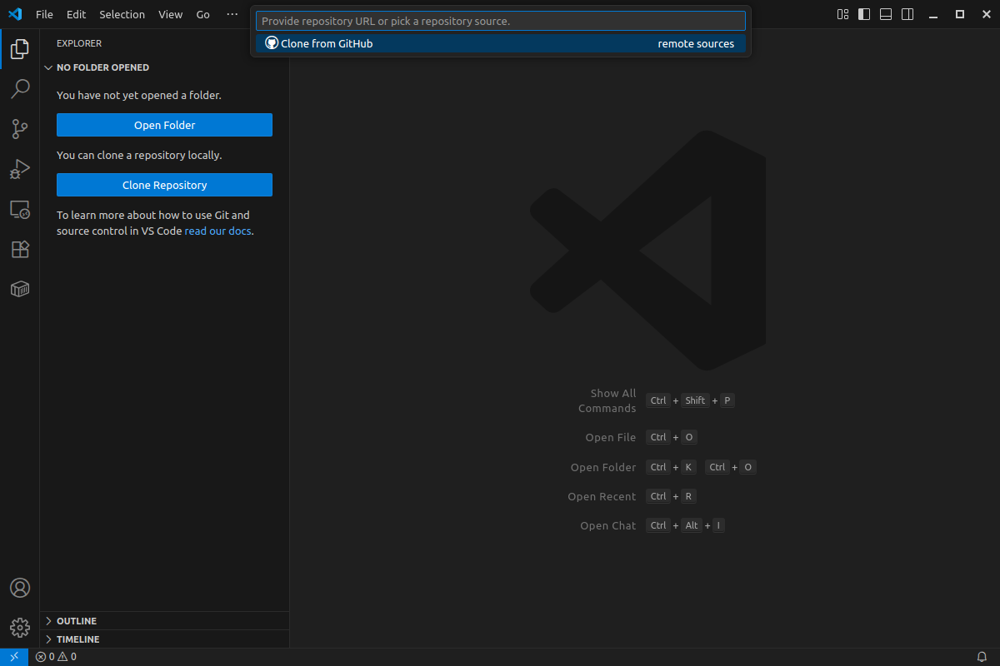
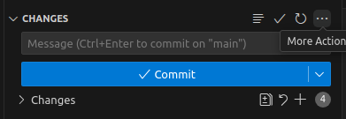

# Astrology-robot-project
super cool physics robot :P

## Project setup
### Step 1: Create a virtual environment

For this step we will be using anaconda.
If you have anaconda already installed then you can create a virtual environment by opening a terminal or the ananconda prompt and enter the following command.
`conda create -n astro_proj python=3.11`

You can replace `astro_proj` with whatever name you like.
It will ask to download a bunch of stuff, type `Y` and press `Enter`.

### Step 2: Open VScode and clone the repository

Open vscode, you will be greeted to a screen as shown below:


Close the `Welcome` page and click on the `Explorer` icon
.
This should be located on the left hand side of the screen.

This should open a selection menu as shown below.


Here, click on `Clone Repository` and this select the clone from github option.


If this is the first time you are cloning something from github then you will get a prompt or a browser pop-up asking you to login with your github account.

Once you have successfully logged in with your github account, you should be able to search for this repository with the notation `upir_username/repository_name`. If we were searching for this repository, then it would be `Chonkusauru/Astrology-robot-project`.
It should look something like this:


Click on or press `Enter` on the repository that you are interested in. It will open up a menu to choose where to donwload the reposity to. Pick a section or folder that you like and confirm.

If you get no errors and everything runs smoothly, then you should have a local copy of the repository on which you can develop on.

### Step 3: Activate your virtual environemnt

Open the terminal in vscode. This can be done with `ctrl+shift+p`
and then type `toggle terminal`. Press `Enter` on the toggle terminal selection.


The command for activating your virtual environment is:
`conda activate <your_environment>`

For example, if your environment's name is `astro_porj` then your
command would be `conda activate astro_proj`

If successfull, you shouldn't get any errors and the name of the environment would 
be displayed before the username in the terminal like this.


Don't worry if that doesn't happen as a pop-up will appear on the bottom right corner of vscode which might state that a conda virtual environment was created but doesn't show up on the terminal.

#### Deactivating your virtual environment
If for some reason you would like to deactivate your environment,
simply enter `conda deactivate` in your terminal.

### Step 4: Installing dependencies

Since we are trying to replicate [this tutorial](https://viyaleta.medium.com/how-to-make-a-sky-map-in-python-a362bf722bb2), we will need to install the necessary libraries for it.

The libraries used are the following:
- [Numpy](https://numpy.org/)
- [Matplotlib](https://matplotlib.org/)
- [Skyfield](https://rhodesmill.org/skyfield/)
- Datetime (This comes preinstalled with python, we don't need to install it seperately)
- [Geopy](https://geopy.readthedocs.io/en/stable/)
- [Tzwhere](https://pypi.org/project/tzwhere/)
- [Pytz](https://pypi.org/project/pytz/)

We will be using the python's package installer called [pip](https://packaging.python.org/en/latest/tutorials/installing-packages/) to install packages / libraries.

You can use the following command to do so.
> [!IMPORTANT]  
> Make sure you are entering this command with your virtual environemnt active!

```
python -m pip install numpy matplotlib skyfield geopy tzwhere pytz
```

If that doesn't work try it with the following:
```
python3 -m pip install numpy matplotlib skyfield geopy tzwhere pytz
```

## Syncing changes to local repository

Anytime changes have been made to the remote repository, you can use this method to update those changes into your local repository.

This is assuming you have completed the [project setup](#project-setup) shown above.

### Select source control in vscode

This is located on the left as show in the image below.


The icon for source contol looks like this: . Ignore the number on it, that just means its tracking the changes made to your repository. More about this will be covered later.

### Inside source control

Once you have selected source control, it would look something like this. 


If you hover your mouse over the `CHANGES` menu, you should see these three bots appear which sould say `more actions`.



If you click on it, you'll get the following options:


In this new pop-up, we are interested in the `Pull` command.
Go ahead and click on `Pull`.


This will "pull" the changes from the github repository and merge it with the local repository, which will update your local repository. 

As a result changes applied in the remote repository (your github repository) will be applied to the local clone/copy of your project(the copy of the project in your laptop).

